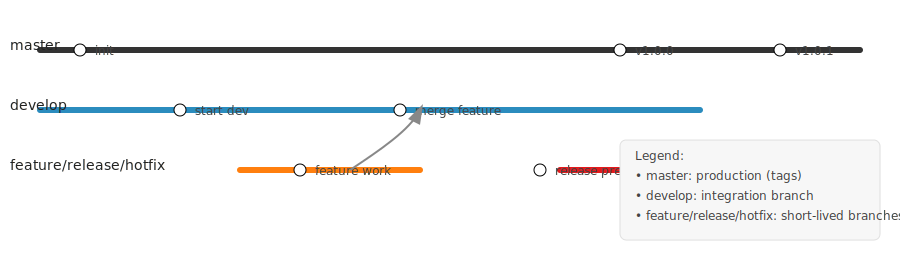

# gitflow_project

## Aperçu

Ce dépôt sert à enseigner Git Flow. Le diagramme ci-dessous (Mermaid gitGraph) visualise les branches principales utilisées dans Git Flow et les transitions typiques entre elles.

`mermaid
%%{init: {'gitGraph': {'showBranchLabels': true}}}%%
gitGraph
  commit
  branch develop
  commit
  branch feature/my-feature
  commit
  checkout develop
  merge feature/my-feature
  branch release/1.0.0
  checkout master
  merge release/1.0.0
  tag v1.0.0
  branch hotfix/urgent-fix
  checkout master
  merge hotfix/urgent-fix
  tag v1.0.1
`

## Qu'est-ce que Git Flow ?

Git Flow est un modèle de branches qui définit une stratégie de branching stricte : une branche longue durée 'master' (ou 'main') pour la production, une branche 'develop' pour le développement continu, et des branches éphémères 'feature/*', 'release/*' et 'hotfix/*' pour le travail spécifique.

## Exercice pour débutant : Mettre en œuvre Git Flow (pas à pas)

Suivez ces étapes dans ce dépôt pour pratiquer Git Flow. Les commandes supposent que le remote s'appelle 'origin' et que la branche par défaut est 'master'. Remplacez les noms si nécessaire.

1. Cloner le dépôt :

   git clone https://github.com/nsrnkably/gitflow_project.git
   cd gitflow_project

2. Créer la branche develop (à partir de master) :

   git checkout -b develop master
   git push -u origin develop

3. Démarrer une branche feature :

   git checkout -b feature/add-login develop
   # effectuer des modifications
   git add .
   git commit -m "Add login feature"
   git push -u origin feature/add-login

4. Ouvrir une Pull Request pour fusionner feature/add-login dans develop ; après revue, fusionner en utilisant --no-ff pour conserver l'historique de branche.

   git checkout develop
   git pull origin develop
   git merge --no-ff feature/add-login
   git push origin develop

5. Créer une branche release lorsque prêt pour la mise en production :

   git checkout -b release/1.0.0 develop
   # mettre à jour la version, la documentation, lancer les tests
   git add .
   git commit -m "Prepare release 1.0.0"
   git push -u origin release/1.0.0

   # Après les vérifications finales, fusionner dans master et develop, puis taguer
   git checkout master
   git merge --no-ff release/1.0.0
   git tag -a v1.0.0 -m "Release 1.0.0"
   git push origin master --tags

   git checkout develop
   git merge --no-ff release/1.0.0
   git push origin develop

6. Processus de hotfix (correction urgente en production) :

   git checkout -b hotfix/urgent-fix master
   # corriger le bug
   git add .
   git commit -m "Fix critical bug"
   git push -u origin hotfix/urgent-fix

   # Après les tests, fusionner dans master et develop
   git checkout master
   git merge --no-ff hotfix/urgent-fix
   git tag -a v1.0.1 -m "Hotfix 1.0.1"
   git push origin master --tags

   git checkout develop
   git merge --no-ff hotfix/urgent-fix
   git push origin develop

## Tâches pour l'étudiant

- Créez une branche feature, implémentez une petite fonctionnalité, ouvrez une PR vers develop, puis fusionnez.
- Créez une branche release, augmentez la version, et réalisez la fusion vers master avec un tag.
- Simulez un hotfix à partir de master et fusionnez la correction dans develop.
- Rédigez de courtes notes dans ce README décrivant ce que vous avez fait pour chaque étape.

Bon apprentissage !\n\nIf the Mermaid diagram above doesn't render on GitHub, view this SVG fallback:\n\n\n